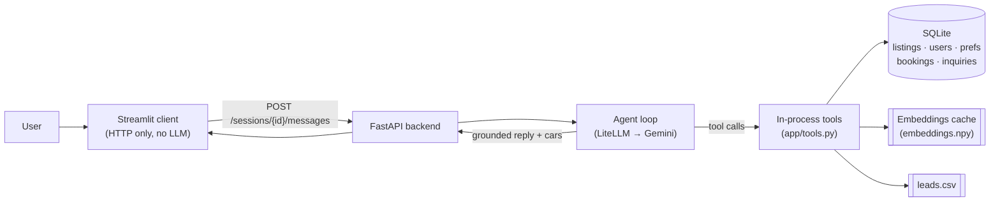
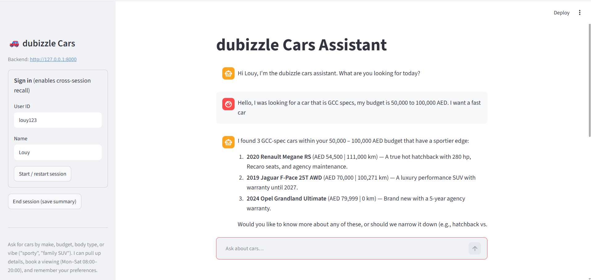
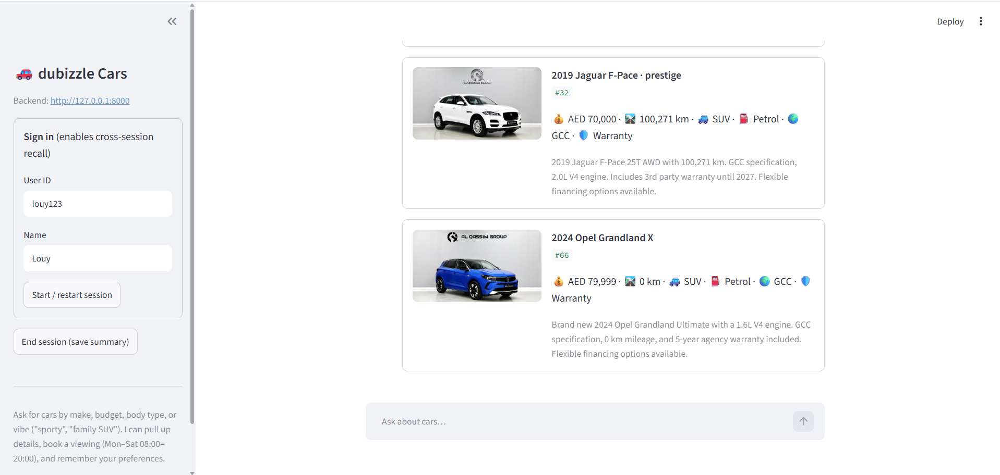
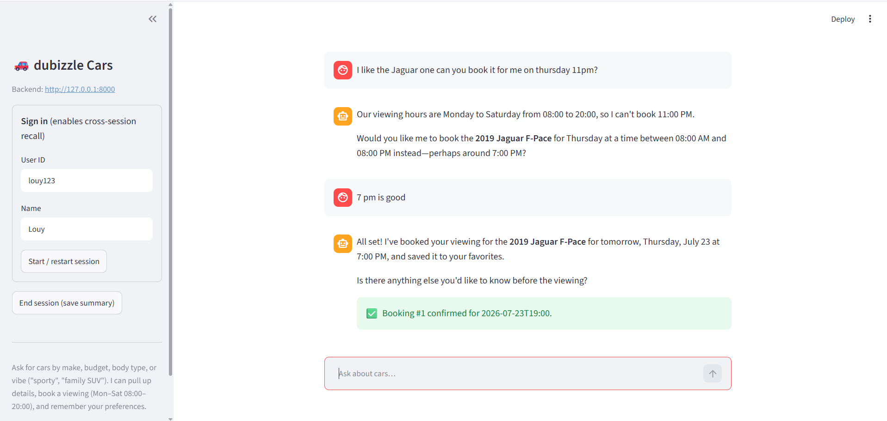
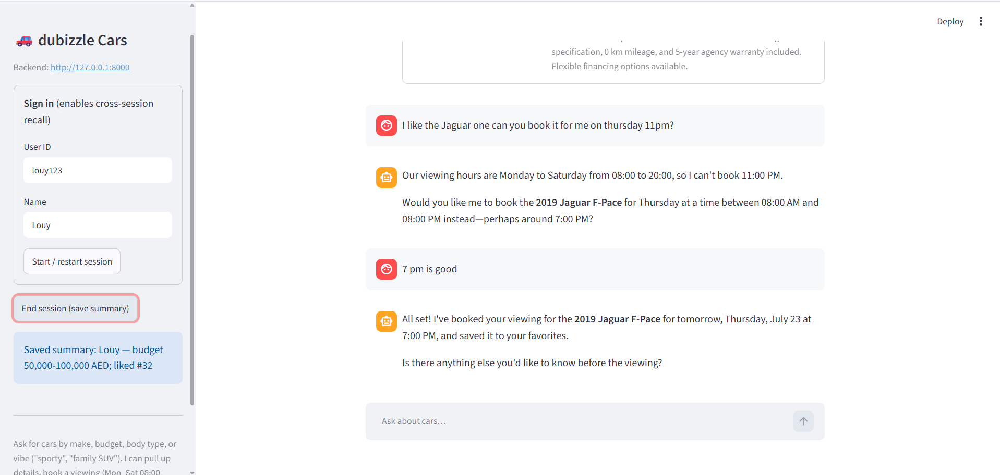
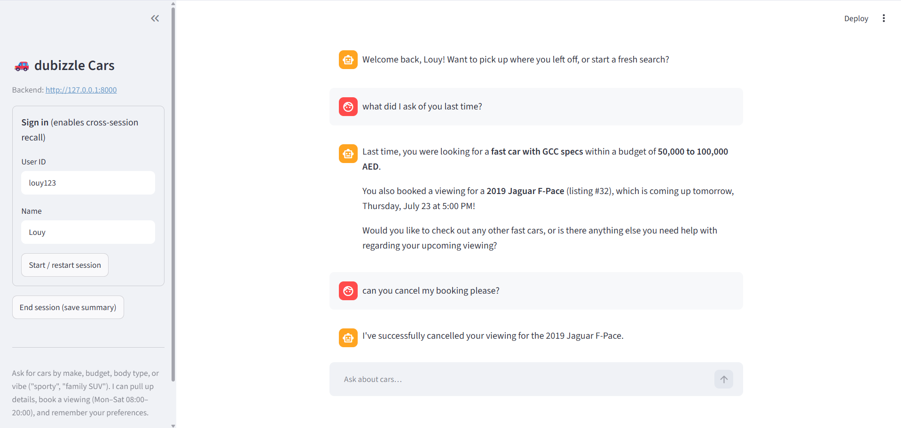

# dubizzle Cars AI Assistant (prototype)

A conversational assistant for the dubizzle used-cars marketplace. It searches
**real** inventory, answers follow-up questions about specific listings,
remembers a user across sessions, books viewings, and captures qualified leads, while staying strictly on-topic (cars only, no competitor talk).

**Stack:** FastAPI (async backend) · LiteLLM → Google Gemini (agent + tool
calling) · Streamlit (chat UI) · SQLite via SQLAlchemy (long-term memory) ·
precomputed embeddings cache (semantic search). Managed with **`uv`**.

> **Grounding rule (enforced):** the agent can only present cars returned by a
> tool call against the real dataset; It never invents listings, prices,
> mileage, or specs. Unknown values are surfaced honestly ("price not listed",
> "finance only").

---

## 1. Quick start

**Prerequisites:** Python 3.12+, [`uv`](https://docs.astral.sh/uv/), and a free
**Google AI Studio** API key.

```bash
uv sync                                   # create venv + install (writes uv.lock)
cp .env.example .env                      # then paste your key into GEMINI_API_KEY
```

**Run the backend** (terminal 1):

```bash
uv run uvicorn app.main:app --port 8000
```

**Run the Streamlit interface** (terminal 2):

```bash
uv run streamlit run client/app.py        # opens http://localhost:8501
```

In the sidebar, enter a **User ID** (e.g. `sara`) and **Name**, click **Start /
restart session**, and chat. Interactive API docs are at
`http://localhost:8000/docs`.

**Also available:**

```bash
uv run python demo/two_session_demo.py    # scripted cross-session recall demo
uv run pytest                             # test suite (offline, no API calls)
```

> The enrichment output (`data/inventory.json`, `data/embeddings.npy`) is
> **committed**, so the app runs immediately with zero setup API calls. Only
> re-run `uv run python scripts/enrich.py` if you want to regenerate it.

---

## 2. Why these choices

**Streamlit over a notebook**: a real, stateful chat UI with card-rendered
results in one small file. It talks to the backend purely over HTTP and makes
**no LLM calls itself**, keeping a clean client/server boundary.

**A lightweight FastAPI + LiteLLM agent loop over a heavier framework** (e.g.
LangChain) keeps the whole agent as one short, auditable loop. It builds a system
prompt, send history + tool schemas to Gemini, run any tool calls, feed
results back, which makes the grounding guarantee easy to see and trust.

**Hybrid retrieval** combines a structured SQL filter (exact constraints like
budget, mileage, body type) with **semantic embedding search** (vibe queries
like "sporty" or "family SUV"); when both are present it filters structurally
first, then ranks the survivors by similarity, so an expensive embedding
comparison never runs over rows a `WHERE` clause could already exclude.

**Memory** uses **SQLite** for durable long-term data (users, preferences,
liked cars, bookings) and an **in-process dict** for hot, per-session
short-term context — one file, one process, zero external services.

---

## 3. How it works

**Design decisions** - The dataset ships with **no Price or Mileage column**,
those live inside messy, sometimes-Arabic, HTML-laden `description` text. A
one-time offline **enrichment** pass ([`scripts/enrich.py`](scripts/enrich.py))
extracts structured fields (LLM + regex fallback) and precomputes one
embedding per listing, so the app starts with **zero** API calls and
structured filtering actually works (see §4). At request time the agent
exposes nine in-process tools (`search_inventory`, `semantic_search`,
`get_listing_details`, `book_viewing`, `cancel_booking`, `get_user_bookings`,
`save_lead`, `get_user_profile`, `update_user_profile`); because the client only
ever receives cars that came back from a tool, hallucinated listings are
structurally impossible. In addition, the agent must call `get_user_bookings` before
answering any "do I have a booking?" question rather than guessing.
Short-term memory tracks the last-shown cars so follow-ups like "the first
one" or "is there a warranty on it?" resolve without restating; durable
preferences are written live via `update_user_profile` and recalled in later
sessions as a briefing injected into the system prompt. Guardrails
(non-automotive + competitor block-list) are enforced in depth: a deterministic
pre-check on the **user's message**, the system prompt, and a post-check on the
**model's reply** (so a competitor name can't slip through even if the model
volunteers one).

**Out of scope / future work** - The in-process tools are deliberately 
framework-free functions with JSON schemas, so they could be exposed as an 
**MCP (FastMCP) server** to let multiple agents/clients share one grounded
tool layer. Long-term memory is fine in SQLite for a prototype but at
multi-tenant scale would move to a managed store such as **Vertex AI Memory
Bank** (with a dedicated vector DB for embeddings). Other natural extensions:
token-by-token streaming, authentication, richer lead qualification with CRM
hand-off, and a nightly re-enrichment ETL job as inventory changes.

---

## 4. The data problem & the ETL pipeline

The provided Excel (`cleaned dataset` sheet, 100 rows) has only **eight
columns**: `Listing_ID, year, make, model, trim, title, description,
photo_url` — no Price, no Mileage. Every attribute a buyer actually filters on
is buried inside free-text `description`, and that text is messy: prices
appear three different ways (cash / finance-only / absent), **16 of 100**
descriptions are wholly or partly **Arabic**, and the text is littered with
HTML, phone numbers, and marketing filler. A query like *"GCC SUV under 120k
with low mileage"* is impossible on the raw sheet, so a one-time offline
pipeline turns it into a clean, queryable dataset:

1. **Extract** — pandas loads the sheet.
2. **Clean** — strip HTML/URLs/phone numbers/hashtags, collapse whitespace.
3. **Transform** — a **hybrid extractor** turns free text into typed fields:
   an LLM pass (Gemini, strict-JSON) reads each listing and returns
   `price_aed`, `monthly_payment_aed`, `mileage_km`, `is_new`,
   `exterior_color`, `body_type`, `transmission`, `fuel_type`,
   `regional_spec`, `has_warranty`, and an English `description_clean` —
   handling Arabic text and the rule that a **cash price is `null` when only
   financing is quoted** (never inferred from a monthly payment). A regex
   pass backstops `price_aed`/`mileage_km` when the LLM misses; the LLM value
   wins on conflict.
4. **Load** — enriched records are written to `data/inventory.json`.
5. **Embed** — one vector per listing (`make model trim year body_type
   description_clean`) is cached to `data/embeddings.npy`.

<details>
<summary>Concrete example — raw description → extracted fields</summary>

```text
RAW (#3): "Payment plans through bank finance: AED 2,111.00 monthly …
AED 119,750.00 in cash. For Sale: 2018 Range Rover Velar R-Dynamic SE …
Mileage: Just 68,000 km … Automatic AWD … Regional Specs: GCC"

EXTRACTED: { price_aed: 119750,  ← cash price, not derived from the monthly figure
             mileage_km: 68000, body_type: "SUV", transmission: "Automatic",
             regional_spec: "GCC", has_warranty: true, is_new: false }
```
</details>

**Result:** from 8 raw columns to a filterable catalogue — `body_type` on
96/100 listings, `fuel_type` on 80, `regional_spec` on 75, `mileage_km` on 46,
`price_aed` on 14. The low price count is correct, not a miss: most listings
are finance-only or dealer marketing, and the extractor deliberately avoids
inventing a price from filler text. This pipeline makes ~200 Gemini calls, so
it runs once and its output is committed (idempotent + resumable, so a
rate-limit interruption resumes for free) — a reviewer never has to run it.

---

## 5. Architecture



| Module | Responsibility |
|---|---|
| `app/main.py` | FastAPI endpoints; one SQLAlchemy session per request; startup seeding + embedding load. |
| `app/agent.py` | System prompt (persona + guardrails + injected memory), input/output guardrail checks, tool-calling loop. |
| `app/tools.py` | The 9 tools + JSON schemas; booking/lead rules; car serialization. |
| `app/db.py` | SQLAlchemy models/schema (SQLite, WAL mode), seeding from `inventory.json`, all queries. |
| `app/retrieval.py` | Structured / semantic / hybrid ranking over the cached embeddings. |
| `app/memory.py` | Short-term session store + long-term briefing/summary. |
| `app/media.py` | Photo-URL normalization + renderability (`.heic` → CDN WebP). |
| `scripts/enrich.py` | One-time offline enrichment (LLM extraction + regex fallback + embeddings). |

### API

Resource-oriented, with the chat turn modelled as a message posted to a session
rather than an RPC-style `/chat` endpoint. Every route declares a Pydantic
**`response_model`**, so `/docs` documents what each endpoint returns (not just
what it accepts), and creation endpoints return **`201 Created`**:

| Method & path | Success | Purpose |
|---|---|---|
| `POST /sessions` | `201` | Create a session (optionally bound to a user) |
| `POST /sessions/{id}/messages` | `200` | Send a message — runs one grounded agent turn |
| `DELETE /sessions/{id}` | `200` | End the session, refresh the user's long-term summary |
| `GET /listings` | `200` | Structured filters + optional `q` for semantic search |
| `GET /listings/{id}` | `200` | Full detail for one car |
| `GET /users/{id}` · `PUT /users/{id}` | `200` | Read / upsert profile + preferences |
| `POST /leads` · `POST /bookings` | `201` | Create a lead / a viewing booking (`409` on a double-booked slot) |
| `DELETE /bookings/{id}` | `200` | Cancel a booking (ownership-checked via `?user_id=`; `404` if not found) |
| `GET /health` | `200` | Liveness + whether embeddings loaded |

**Concurrency.** Each request gets its own SQLAlchemy session (a FastAPI
dependency) and the database runs in **WAL** mode, so reads never block each
other and a multi-second agent turn doesn't freeze the rest of the API — a
`GET /listings` issued while a chat turn is in flight still returns in a few
hundredths of a second.

---

## 6. Demo

### 6.1 Grounded inventory search



Louy asks for a *fast*, GCC-spec car under 100k AED. The agent runs a hybrid
search (hard budget/spec filters + a "fast" semantic rank) and returns three
**real** listings with real prices and mileage — nothing invented.



The same results as cards — photo, price, mileage, body type, fuel, spec, and
warranty — with the listing photos rendered inline (including `.heic` uploads
the CDN serves as WebP).

### 6.2 Booking with rule enforcement



An 11 PM request is refused (viewings run Mon–Sat 08:00–20:00); the agent
proposes 7 PM, and on confirmation books it — the green banner shows the booking
persisted as **Booking #1**.

### 6.3 Ending a session (persist long-term memory)



Clicking **End session** writes a compact summary to the user's profile
(*"Louy — budget 50,000–100,000 AED; liked #32"*) — the write side of long-term
memory that powers the recall below.

### 6.4 Returning user — recall & cancellation



A brand-new session greets Louy by name and recalls both his saved preference
(fast GCC car, 50–100k) **and** his upcoming Jaguar F-Pace viewing, then cancels
that booking on request — each fact read back from the database, not guessed.

> Reproduce the cross-session recall headlessly with
> `uv run python demo/two_session_demo.py`.

---

## 7. Tests

`uv run pytest` — fully offline (the LLM is faked where needed; no API calls):

- **Structured search** returns only real listings; null cash prices excluded from
  price filters and sorted last.
- **Grounding** — a faked model that name-drops a non-existent car still yields a
  `cars` payload of only real, tool-sourced listings.
- **Reference resolution** — "the first Honda" → "warranty on it?" via short-term memory.
- **Booking** rejects Sunday / out-of-hours / past / duplicate slot; bookings are
  read back and cancelled (ownership-checked) rather than guessed.
- **Long-term profile & bookings** persist across sessions and drive the
  returning-user briefing.
- **Guardrails** decline non-automotive + competitor mentions on input (without
  calling the LLM) **and** scrub a competitor name the model volunteers in its reply.
- **Media** — dubizzle `.heic` CDN links are treated as renderable WebP.

---

## 8. Repo layout

```
.
├── pyproject.toml / uv.lock       # uv project + lockfile
├── .env.example                   # GEMINI_API_KEY=, model overrides
├── README.md
├── app/                           # FastAPI backend + agent
│   ├── main.py  agent.py  tools.py
│   ├── db.py  retrieval.py  memory.py  media.py  config.py
├── client/app.py                  # Streamlit chat UI
├── scripts/enrich.py              # one-time offline enrichment
├── demo/two_session_demo.py       # cross-session recall demo
├── tests/                         # pytest suite (offline)
├── docs/screenshots/              # ← put screenshots here
└── data/
    ├── Copy_of_sample_cars_dataset.xlsx
    ├── inventory.json             # committed enrichment output
    ├── embeddings.npy  embeddings_ids.json   # committed
    ├── app.db                     # created on first run (gitignored)
    └── leads.csv                  # created on first run (gitignored)
```
